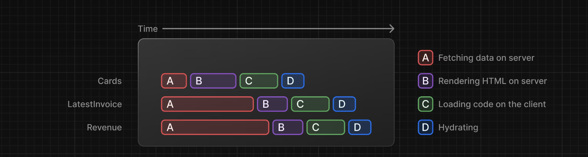
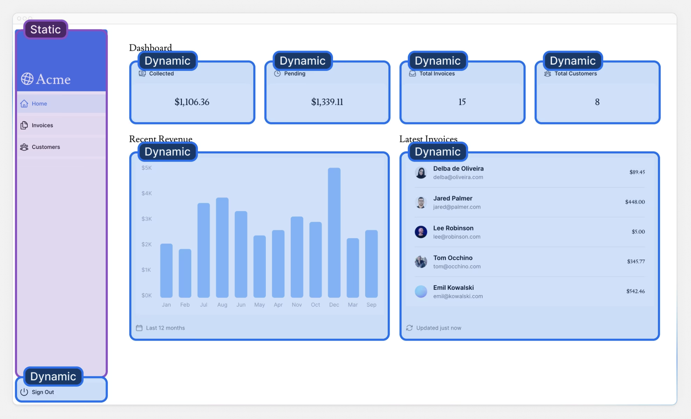

## Next.js App Router Course - Starter

This is the starter template for the Next.js App Router Course. It contains the starting code for the dashboard application.

For more information, see the [course curriculum](https://nextjs.org/learn) on the Next.js Website.

## 폴더 구조



- `/app:` 애플리케이션에 필요한 모든 경로, 구성 요소, 논리가 포함되어 있습니다. 주로 여기에서 작업을 진행하게 됩니다.

- `/app/lib:` 재사용 가능한 유틸리티 함수, 데이터 가져오기 함수 등 애플리케이션에서 사용되는 함수가 포함되어 있습니다.

- `/app/ui:` 카드, 테이블, 양식 등 애플리케이션의 모든 UI 구성 요소를 포함합니다. 시간을 절약하기 위해 이러한 구성 요소를 미리 스타일 지정했습니다.

- `/public:`이미지 등 애플리케이션의 모든 정적 자산을 포함합니다.-

- 구성 파일`next.config.js :` 애플리케이션 루트 와 같은 구성 파일도 볼 수 있습니다 . 이러한 파일의 대부분은 .를 사용하여 새 프로젝트를 시작할 때 생성되고 사전 구성됩니다 create-next-app. 이 과정에서는 이를 수정할 필요가 없습니다.

## 부분 렌더링

### 정적 렌더링

- 더 빠른 웹사이트 - 사전 렌더링된 콘텐츠는 캐시되어 전 세계적으로 배포될 수 있습니다. 이를 통해 전 세계 사용자가 귀하의 웹사이트 콘텐츠에 더 빠르고 안정적으로 액세스할 수 있습니다.
- 서버 부하 감소 - 콘텐츠가 캐시되므로 서버는 사용자 요청에 따라 콘텐츠를 동적으로 생성할 필요가 없습니다.
- SEO - 사전 렌더링된 콘텐츠는 검색 엔진 크롤러가 색인하기 더 쉽습니다. 페이지가 로드될 때 콘텐츠가 이미 사용 가능하기 때문입니다. 이는 검색 엔진 순위를 개선하는 데 도움이 될 수 있습니다.

### 동적 렌더링

- 실시간 데이터 - 동적 렌더링을 통해 애플리케이션에서 실시간 또는 자주 업데이트되는 데이터를 표시할 수 있습니다. 이는 데이터가 자주 변경되는 애플리케이션에 이상적입니다.
- 사용자별 콘텐츠 - 대시보드나 사용자 프로필과 같은 개인화된 콘텐츠를 제공하고 사용자 상호 작용에 따라 데이터를 업데이트하는 것이 더 쉽습니다.
- 요청 시간 정보 - 동적 렌더링을 사용하면 쿠키나 URL 검색 매개변수와 같이 요청 시점에서만 알 수 있는 정보에 액세스할 수 있습니다.

#### 정적 경로 대 동적 경로

오늘날 구축된 대부분의 웹 앱의 경우 전체 애플리케이션 또는 특정 경로 에 대해 정적 및 동적 렌더링 중에서 선택한다.
그리고 Next.js에서 경로에서 동적 함수를 호출하면 (예: 데이터베이스 쿼리) 전체 경로가 동적이 된다.



- 구성 <SideNav>요소는 데이터에 의존하지 않으며 사용자에 맞게 개인화되지 않으므로 정적 일 수 있다.
- 구성요소는 <Page>자주 변경되는 데이터에 의존하며 사용자에게 맞게 개인화되므로 동적 일 수 있다 .

### 느린 데이터를 개선하는 방법

1. 스트리밍이란 무엇이고 언제 사용할 수 있나요?

- 스트리밍은 경로를 더 작은 "조각"으로 나누고 데이터가 준비되면 서버에서 클라이언트로 점진적으로 스트리밍할 수 있는 데이터 전송 기술
  

Next.js에서 스트리밍을 구현하는 방법은 두 가지가 있습니다.

페이지 수준에서 loading.tsx파일을 사용합니다.
특정 구성요소의 경우 <Suspense>.

2. Suspense를 사용하여 스트리밍을 구현하는 방법 loading.tsx. 3. 로딩 스켈레톤이란? 4. 신청서에서 서스펜스 경계를 ​​어디에 두어야 할까요?

### 사용 방법

React의 Suspense를 사용

> Suspense 폴백은 정적 콘텐츠와 함께 초기 HTML 파일에 내장. 빌드 시(또는 재검증 시) 정적 콘텐츠는 정적 셸을 생성하기 위해 사전 렌더링이 된다. 동적 콘텐츠의 렌더링은 사용자가 경로를 요청할 때까지 연기 된다

```
next.config.mjs

/** @type {import('next').NextConfig} */

const nextConfig = {
  experimental: {
    ppr: 'incremental',
  },
};

export default nextConfig;

```

- 'incremental'값을 사용하면 특정 경로에 PPR을 채택할 수 있다

```
app/dashboard/layout.tsx

import SideNav from '@/app/ui/dashboard/sidenav';

export const experimental_ppr = true;

// ...
```

- Next.js는 경로의 정적 부분을 미리 렌더링하고 사용자가 요청할 때까지 동적 부분을 연기
- Suspense를 사용하여 경로의 동적 부분을 래핑하는 한 Next.js는 경로의 어떤 부분이 정적이고 어떤 부분이 동적인지 알 수 있음
